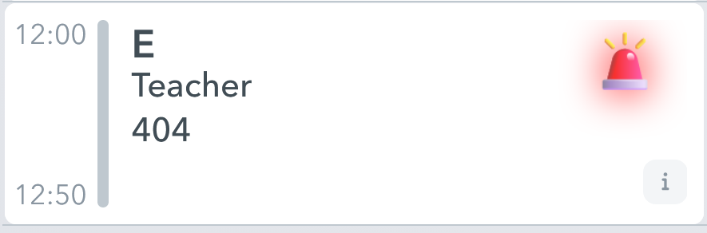
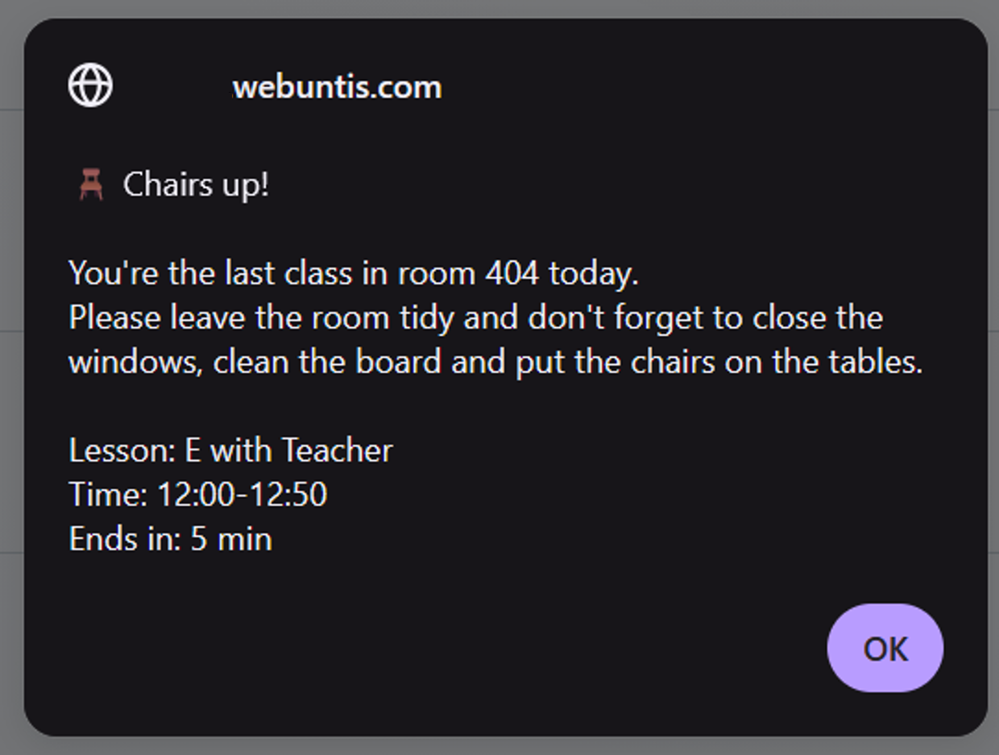
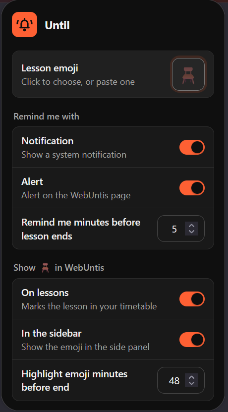

# Until

### Know when you're the last class in the room with Until.

 

A browser extension for WebUntis that marks the lessons where nobody uses the room after you, and reminds you before they end.

---

## Why I built this

At my school, the last class in a room has to put the chairs up before leaving for the day. But to know if you're the last one, you have to open your timetable, find the room, open the room's timetable and check if another class comes after you. Nobody wants to do that every day.

So it often happens that the cleaning staff needs to put the chairs up instead.

That's why a teacher asked me if I wanted to build an extension that does the checking for us.

## How it works

1. **It looks at your timetable.** Until goes through every lesson you have this week.
2. **It checks each room.** It looks at that room's timetable to see if another class comes in after you.
3. **It marks the lesson.** If nobody comes after you, the lesson gets an emoji in your WebUntis timetable.
4. **It reminds you.** A few minutes before the lesson ends, you get a notification.

It runs in your browser, uses your normal WebUntis login and doesn't send your data anywhere.

## Choose your own emoji

1. Click the Until icon in your browser's toolbar.
2. Click the emoji field next to Lesson emoji and pick one from the list.
3. Want one that isn't in the list? Click into the emoji field and either:
   - open your system's emoji keyboard: <kbd>Win</kbd> + <kbd>.</kbd> on Windows, <kbd>Ctrl</kbd> + <kbd>⌘</kbd> + <kbd>Space</kbd> on Mac
   - or copy an emoji from anywhere (a chat, [Emojipedia](https://emojipedia.org), Google, ...) and paste it with <kbd>Ctrl</kbd> + <kbd>V</kbd> (Mac: <kbd>⌘</kbd> + <kbd>V</kbd>). It then gets added to the list, so you can switch back to it later.

## Languages

Until comes in **English** and **German**. It shows the correct one depending on your browser's language. Any other language falls back to English.

**Want Until in your language?** Send me a translation and I'll add it! The texts are in two places:

1. **The popup:** copy the `_locales/en` folder and rename it to your language code, for example `_locales/fr` for French or `_locales/es` for Spanish. In its `messages.json`, translate only the `"message"` values. Leave the keys (like `"lessonEmoji"`) as they are.
2. **The alert and notification:** in [`variables.js`](src/variables.js), copy the `en: { ... }` block under `texts`, rename it to your language code and translate it. Leave the `{placeholders}` as they are.
3. Open a [pull request](../../pulls) or an [issue](../../issues) with your files.

## Using Until at your school

Need different texts, emojis or default settings for your school? They're all in [`variables.js`](src/variables.js). How to edit it is in [SCHOOL_SETUP.md](SCHOOL_SETUP.md).

## Screenshots

 

The last lesson in the room gets marked in your timetable. While that lesson is running, the emoji lights up.

  

 

A few minutes before the end, you get a reminder.

  

 

Pick your emoji and choose how and when you get reminded.

## Installation

**Chrome / Edge**

1. [Download this repository](../../archive/refs/heads/main.zip) and unzip it.
2. Open Chrome or Edge and type in `chrome://extensions`. Turn on **Developer mode**.
3. Click **Load unpacked** and select the unzipped folder.

> The extension stays installed, even after a restart. Just don't move or delete the folder, because the browser runs it from there.

**Firefox**

1. [Download this repository](../../archive/refs/heads/main.zip) and unzip it.
2. Open `about:debugging#/runtime/this-firefox`.
3. Click **Load Temporary Add-on…** and select `manifest.json`.

> Firefox removes temporary add-ons every time it restarts, so sadly you have to load it again.

## Disclaimer

Until is an independent project and is **not affiliated with or endorsed by Untis GmbH**. Untis and WebUntis are trademarks of Untis GmbH.

Uses [ky](https://github.com/sindresorhus/ky) by Sindre Sorhus (MIT).

## License

[PolyForm Noncommercial 1.0.0](LICENSE) © 2026 alexius2408

You can use, change and share Until for free, as long as you don't make money with it.
